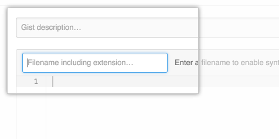
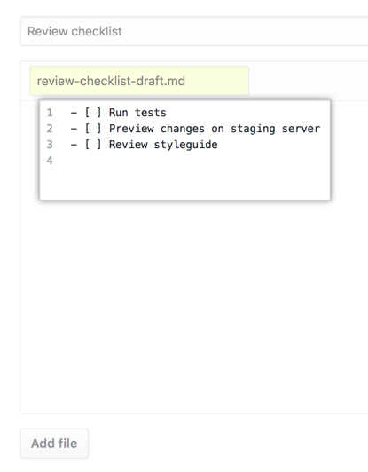
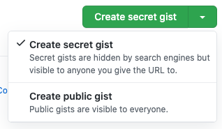
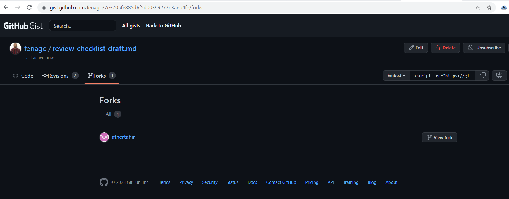
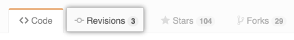
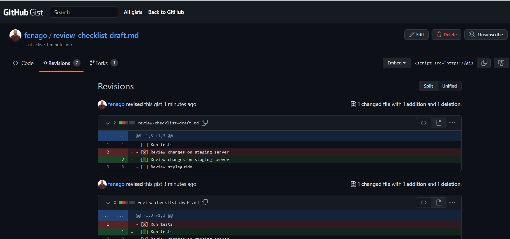

## Creating gists

You can create two kinds of gists: public and secret. Create a public
gist if you\'re ready to share your ideas with the world or a secret
gist if you\'re not.

About gists
------------

Gists provide a simple way to share code snippets with others. Every
gist is a Git repository, which means that it can be forked and cloned.
If you are signed in to GitHub when you create a gist, the gist will be
associated with your account and you will see it in your list of gists
when you navigate to your [gist home page](https://gist.github.com/).

Gists can be public or secret. Public gists show up in
[Discover](https://gist.github.com/discover), where people can browse
new gists as they\'re created. They\'re also searchable, so you can use
them if you\'d like other people to find and see your work.

Secret gists don\'t show up in
[Discover](https://gist.github.com/discover) and are not searchable
unless you are logged in and are the author of the secret gist. Secret
gists aren\'t private. If you send the URL of a secret gist to a friend,
they\'ll be able to see it. However, if someone you don\'t know
discovers the URL, they\'ll also be able to see your gist. If you need
to keep your code away from prying eyes, you may want to [create a
private
repository]
instead.

After creating a gist, you cannot convert it from public to secret.

You\'ll receive a notification when:

-   You are the author of a gist.
-   Someone mentions you in a gist.
-   You subscribe to a gist, by clicking **Subscribe** at the top of any
    gist.

Creating a gist
---------------

Follow the steps below to create a gist.

Alternatively, you can drag and drop a text file from your desktop
directly into the editor.

1.  Sign in to GitHub.

2.  Navigate to your [gist home page](https://gist.github.com/).

3.  Type an optional description and name for your gist. 

    

4.  Type the text of your gist into the gist text box. 

    

5.  Optionally, to create a public gist, click , then click **Create public gist**. 
    
    

6.  Click **Create secret Gist** or **Create public gist**. 

    

#### Forking and cloning gists

Gists are actually Git repositories, which means that you can fork or
clone any gist, even if you aren\'t the original author. You can also
view a gist\'s full commit history, including diffs.

Forking gists
------------------------------------

Each gist indicates which forks have activity, making it easy to find
interesting changes from others.

`https://gist.github.com/fenago/7e3705fe885d6f5d00399277e3aeb4fe`

Viewing gist commit history
----------------------------------------------------------------

To view a gist\'s full commit history, click the \"Revisions\" tab at
the top of the gist.

You will see a full commit history for the gist with diffs.

