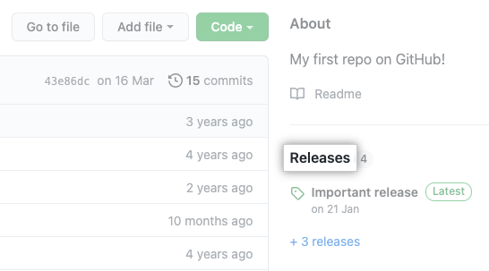
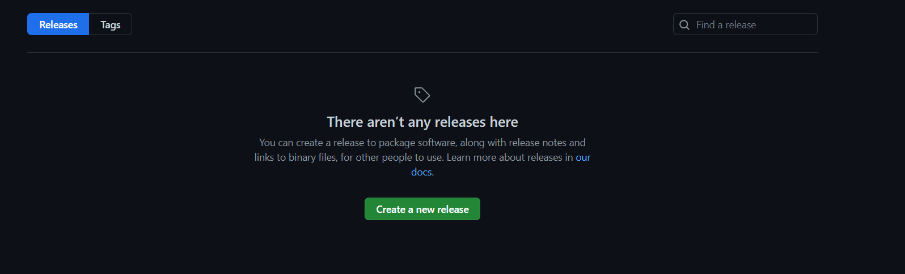
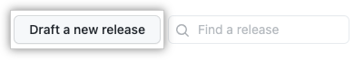

Managing releases in a repository
=================================

In this lab

- About release management
- Creating a release
- Editing a release
- Deleting a release

You can create releases to bundle and deliver iterations of a project to
users.

**Who can use this feature**

Repository collaborators and people with write access to a repository
can create, edit, and delete a release.

Creating a release
------------------------------------

1.  On GitHub.com, navigate to the main page of the repository.

2.  To the right of the list of files, click **Releases**. 
    
    

3.  Click **Create a new release**.

    

4.  Click **Choose a tag**, type a version number for your release, and
    press **Enter**. Alternatively, select an existing tag.

    

5.  If you are creating a new tag, click **Create new tag**.

    

6.  If you have created a new tag, use the drop-down menu to select the
    branch that contains the project you want to release.

    

7.  Optionally, to the top right of the description text box, select the
    **Previous tag** drop-down menu and click the tag that identifies
    the previous release. 

8.  Type a title and description for your release. If you \@mention
    anyone in the description, the published release will include a
    **Contributors** section with an avatar list of all the mentioned
    users. Alternatively, you can automatically generate your release
    notes by clicking **Generate release notes**.

    

9.  Optionally, to include binary files such as compiled programs in
    your release, drag and drop or manually select files in the binaries
    box.

10. To notify users that the release is not ready for production and may
    be unstable, select **Set as a pre-release**.

    

11. If you\'re ready to publicize your release, click **Publish
    release**. To work on the release later, click **Save draft**.
    

    You can then view your published or draft releases in the releases
    feed for your repository.

    

Editing a release
------------------------------------

1.  On GitHub.com, navigate to the main page of the repository.

2.  To the right of the list of files, click **Releases**. 

    

3.  On the right side of the page, next to the release you want to edit,
    click . 
    
    

4.  Edit the details for the release in the form, then click **Update
    release**. If you add or remove any \@mentions of GitHub users in
    the description, those users will be added or removed from the
    avatar list in the **Contributors** section of the release.

    

Releases cannot currently be edited with GitHub CLI.

Deleting a release
------------------------------------

1.  On GitHub.com, navigate to the main page of the repository.

2.  To the right of the list of files, click **Releases**. 

    

3.  On the right side of the page, next to the release you want to
    delete, click . 
    
    

4.  Click **Delete this release**. 
    
    

Task: Creating a New Release
----------------------------
In this task, you will create another new release. Please keep following points while completing this task:

1. You will see **Draft a new release** instead of **Create a new release** now.

    

2. You can select **Set as latest release**. If you do not
    select this option, the latest release label will automatically be
    assigned based on semantic versioning.

    