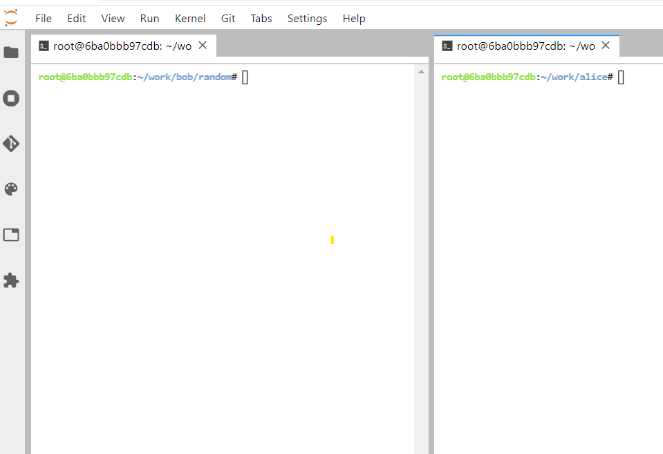

Lab: Git in Practice
--------------------


In this lab, the focus will be on providing practical aspects of the technology,
showing and explaining basic version control operations in the example
of the development of a sample project, and collaboration between two
developers.

### Create New Repository

**Note:** You will GitHub account to complete this lab.

1. Open following URL in browser, click **Fork** and open the link in a new tab.
   `https://github.com/`

   

2. In the new tab, follow the prompts to create a new repository.

   

Bob gets the information that the project repository
is ready, and he can start coding.

Since this is Bob\'s first time using Git, he first sets up his
`~/.gitconfig` file with information that will be used to
identify his commits in the log:

```
[user]
  name = Bob Hacker
  email = bob@company.com
```


Now he needs to get his own repository instance:

```
bob@hostB ~$ cd ~/work
bob@hostB ~$ mkdir bob && cd bob
bob@hostB ~$ git clone https://github.com/fenago/random.git

Cloning into random...
Warning: You appear to have cloned an empty repository.
done.
bob@hostB ~$ cd random
bob@hostB random$
```


Bob notices that Git said that it is an empty
repository, with no source code yet, and starts
coding. He opens his text editor and creates the starting point for
their product:

```
#include <stdio.h>
#include <stdlib.h>

int random_int(int max)
{
  return rand() % max;
}

int main(int argc, char *argv[])
{
  if (argc != 2) {
    fprintf(stderr, "Usage: %s <number>\n", argv[0]);
    return EXIT_FAILURE;
  }

  int max = atoi(argv[1]);

  int result = random_int(max);
  printf("%d\n", result);

  return EXIT_SUCCESS;
}
```


Typically, like for most initial implementations, this version is
missing a lot of features. But it\'s a good place to begin. Before
committing his code, Bob wants to make sure that it compiles and runs:

```
bob@hostB random$ gcc -std=c99 random.c
bob@hostB random$ ls -l
total 43
-rwxr-xr-x  1 bob   staff  86139  May 29 17:36 a.out
-rw-r--r--  1 bob   staff    331  May 19 17:11 random.c
bob@hostB random$ ./a.out
Usage: ./a.out <number>
bob@hostB random$ ./a.out 10
1
```


Alright! It\'s time to `add` this file to the repository:

```
bob@hostB random$ git add random.c
```


Bob uses the status operation to make sure that the pending changeset
(the future commit) looks proper:


### Note

We use here a short form of the `git status` to reduce the
amount of space taken by examples; you can find an example of full
status output further in the lab.


```
bob@hostB random$ git status -s
A  random.c
?? a.out
```


Git is complaining because it does not know what to
do about the `a.out` file: it is neither
tracked nor ignored. That\'s a compiled executable, which as a generated
file should not be stored in a version control repository. Bob can just
ignore that issue for the time being.

Now it\'s time to `commit` the file:

```
bob@hostB random$ git commit -a -m "Initial implementation"
[master (root-commit) 2b953b4] Initial implementation
 1 file changed, 22 insertions(+)
 Create mode 100644 random.c
```


Using Personal Access Tokens with GIT and GitHub to Push.
=========================================================

Password authentication is no longer accepted when
trying to sync your local repository to your github repository and
instead has been replaced with the use of a PERSONAL ACCESS TOKEN. We will now show you 
how to get your Personal Access Token and use
it to sync your local and remote repositories.

To get your Personal Access Token, go to your page on github, on the top
right corner and click on the circle which has a dropdown arrow attached
to it and go further to click on settings


While on Settings, on the left side of the page, Theres a sub-heading
which says Account settings, scroll to the bottom and click on Developer
Settings, While in the developer Settings page, click on Personal Access
Tokens. On the right side of the Personal Access Tokens Page, click
"Generate New Token"


and a new page will pop up titled "New Personal Access Token" and from
this point all you have to do is select the expiration period of the
PAT(how long you want it to be valid for) and fill a description box
which is titled "Note" to state what you would be using the access token
for, then you select the scope for which we will use the access tokens.
Since we're working with repositories all you have to do is tick the
"repo" box and scroll


all the way to the bottom then click "Generate Token" and you will be
able to see your Personal Access Token but you must copy and save it
somewhere secure because as soon as you close the page you will no
longer be able to see it.


Finally, when you try to carry out any command, e.g push, a popup will
prompt you to put your Github Credentials and this time instead of
putting your password in the password form, you will input your Personal
Access Token and it will work just fine!


### Publishing changes


After finishing working on the initial version of
the project, Bob decides that it is ready to be published (to be made
available for other developers). He pushes the changes:

```
bob@hostB random$ git push
warning: push.default is unset; its implicit value has changed in
Git 2.0 from 'matching' to 'simple'. To squelch this message [...]
To https://github.com/fenago/random.git
 * [new branch]      master -> master
bob@hostB random$ git config --global push.default simple
```

   


### Examining history and viewing changes

**Note:** If you have git setup on another machine. You can run all `Alice` user commands in that machine. Otherwise, you can also run following commands in the same lab environment by opening the new terminal as shown below:

```
alice@hostA ~$ cd ~/work
alice@hostA ~$ mkdir alice && cd alice
```

   


Since it is Alice\'s first time using Git on her
desktop machine, she first tells Git how her commits should be
identified:

```
alice@hostA ~$ git config --global user.name "Alice Developer"
alice@hostA ~$ git config --global user.email alice@company.com
```


Now Alice needs to set up her own repository instance:

```
alice@hostA ~$ git clone https://github.com/fenago/random.git
Cloning into random...
done.
```


Alice examines the working directory:

```
alice@hostA ~$ cd random
alice@hostA random$ ls -al
total 1
drwxr-xr-x    1 alice staff        0 May 30 16:44 .
drwxr-xr-x    4 alice staff        0 May 30 16:39 ..
drwxr-xr-x    1 alice staff        0 May 30 16:39 .git
-rw-r--r--    1 alice staff      353 May 30 16:39 random.c
```


She wants to check the `log` to see the details (to examine
the project history):

```
alice@hostA random$ git log
commit 2b953b4e80abfb77bdcd94e74dedeeebf6aba870
Author: Bob Hacker <bob@company.com>
Date:   Thu May 29 19:53:54 2015 +0200

    Initial implementation
```


When Alice decides to take a look at the code, she
immediately finds something horrifying. The random number generator is
never initialized! A quick test shows that the program always generates
the same number. Fortunately, it is only necessary to add one line to
`main()`, and the appropriate `#include`:

```
#include <stdio.h>
#include <stdlib.h>
#include <time.h>

int random_int(int max)
{
  return rand() % max;
}

int main(int argc, char *argv[])
{
  if (argc != 2) {
    fprintf(stderr, "Usage: %s <number>\n", argv[0]);
    return EXIT_FAILURE;
  }

  int max = atoi(argv[1]);

  srand(time(NULL));
  int result = random_int(max);
  printf("%d\n", result);

  return EXIT_SUCCESS;
}
```


She compiles the code, and runs it a few times to check that it really
generates random numbers. Everything looks alright, so she uses the
`status` operation to see the pending changes:

```
alice@hostA random$ git status -s
 M random.c
```


No surprise here. Git knows that `random.c` has been modified.
She wants to double-check by reviewing the actual
changes with the `diff` command:


```
alice@hostA random$ git diff
diff --git a/random.c b/random.c
index cc09a47..5e095ce 100644
--- a/random.c
+++ b/random.c
@@ -1,5 +1,6 @@
 #include <stdio.h>
 #include <stdlib.h>
+#include <time.h>

 int random_int(int max)
 {
@@ -15,6 +16,7 @@ int main(int argc, char *argv[])

   int max = atoi(argv[1]);

+  srand(time(NULL));
   int result = random_int(max);
   printf("%d\n", result);
```


Now it\'s time to commit the changes and push them to the public
repository:

```
alice@hostA random$ git commit -a -m "Initialize random number generator"
[master db23d0e] Initialize random number generator
 1 file changed, 2 insertions(+)
alice@hostA random$ git push
To https://github.com/fenago/random.git
   3b16f17..db23d0e master -> masterRenaming and moving files
```


### Renaming and moving files


Bob moves on to his next task, which is to restructure the tree a bit.
He doesn\'t want the top level of the repository to get too cluttered so
he decides to move all their source code files into a `src/`
subdirectory:

```
bob@hostA random$ mkdir src
bob@hostA random$ git mv random.c src/
bob@hostA random$ git status -s
R  random.c -> src/random.c
bob@hostA random$ git commit -a -m "Directory structure"
[master 69e0d3d] Directory structure
 1 file changed, 0 insertions(+), 0 deletions(-)
 rename random.c => src/random.c (100%)
```


While at it, to minimize the impact of reorganization on the
`diff` output, he configures Git to always use rename and copy
detection:

```
bob@hostB random$ git config --global diff.renames copies
```


Bob then decides the time has come to create a
proper `Makefile`, and to add a `README` for a
project:

```
bob@hostA random$ touch README
bob@hostA random$ touch Makefile
bob@hostA random$ git add README Makefile
bob@hostA random$ git status -s
A  Makefile
A  README
bob@hostA random$ git commit -a -m "Added Makefile and README"
[master abfeea4] Added Makefile and README
 2 files changed, 15 insertions(+)
 create mode 100644 Makefile
 create mode 100644 README
```


Bob decides to rename `random.c` to `rand.c`:

```
bob@hostA random$ git mv src/random.c src/rand.c
```


This of course also requires changes to the `Makefile`:

```
bob@hostA random$ echo "updated" > Makefile
bob@hostA random$ git status -s
 M Makefile
R  src/random.c -> src/rand.c
```


He then commits those changes.

```
bob@hostA random$ git commit -a -m "Rename random.c and updated Makefile"
```


### Updating your repository (with merge)


Reorganization done, now Bob tries to publish those
changes:

```
bob@hostA random$ git push
$ git push
To https://github.com/fenago/random.git
 ! [rejected]        master -> master (fetch first)
error: failed to push some refs to 'https://github.com/fenago/random.git'
hint: Updates were rejected because the remote contains work that you do
hint: not have locally. This is usually caused by another repository pushing
hint: to the same ref. You may want to first integrate the remote changes
hint: (e.g., 'git pull ...') before pushing again.
hint: See the 'Note about fast-forwards' in 'git push --help' for details.
```


But Alice was working at the same time and she had her change ready to
commit and push first. Git is not allowing Bob to publish his changes
because Alice has already pushed something to the
master branch, and Git is preserving her changes.


### Note

Hints and advices in Git command output will be skipped from here on for
the sake of brevity.


Bob uses `pull` to bring in changes (as described in
`hint` in the command output):

```
bob@hostB random $ git pull
From https://github.com/fenago/random.git
 + 3b16f17...db23d0e master     -> origin/master
Auto-merging src/rand.c
Merge made by the 'recursive' strategy.
 src/rand.c | 2 ++
 1 file changed, 2 insertions(+)
```


Git `pull` fetched the changes, automatically merged them with
Bob\'s changes, and committed the merge.

Everything now seems to be good:

```
bob@hostB random$ git show
commit ba5807e44d75285244e1d2eacb1c10cbc5cf3935
Merge: 3b16f17 db23d0e
Author: Bob Hacker <bob@company.com>
Date:   Sat May 31 20:43:42 2015 +0200

    Merge branch 'master' of https://github.com/fenago/random.git
```


The merge commit is done. Apparently, Git was able to merge Alice\'s
changes directly into Bob\'s moved and renamed copy of a file without
any problems. Marvelous!

Bob checks that it compiles (because [*automatically merged*]
does not necessarily mean that the merge output is correct), and is
ready to push the merge:

```
bob@hostB random$ git push
To https://github.com/fenago/random.git
   db23d0e..ba5807e  master -> master
```


### Creating a tag


Alice and Bob decide that the project is ready for
wider distribution. Bob creates a `tag` so they can more
easily access/refer to the released version. He uses an []{#id22
.indexterm} [**annotated tag**] for this; an often used
alternative is to use  [**signed tag**],
where the annotation contains a PGP signature (which can later be
verified):

```
bob@hostB random$ git tag -a -m "random v0.1" v0.1
bob@hostB random$ git tag --list
v0.1
bob@hostB random$ git log -1 --decorate --abbrev-commit
commit ba5807e (HEAD -> master, tag: v0.1, origin/master)
Merge: 3b16f17 db23d0e
Author: Bob Hacker <bob@company.com>
Date:   Sat May 31 20:43:42 2015 +0200

    Merge branch 'master' of https://github.com/fenago/random.git
```


Of course, the `v0.1` tag wouldn\'t help
if it was only in Bob\'s local repository. He therefore pushes the just
created `tag`:

```
bob@hostB random$ git push origin tag v0.1
Counting objects: 1, done.
Writing objects: 100% (1/1), 162 bytes, done.
Total 1 (delta 0), reused 0 (delta 0)
Unpacking objects: 100% (1/1), done.
To https://github.com/fenago/random.git
 * [new tag]         v0.1 -> v0.1
```


Alice updates her repository to get the `v0.1` tag, and to
start with up-to-date work:

```
alice@hostA random$ git pull
From https://github.com/fenago/random.git
   f4d9753..be08dee  master     -> origin/master
 * [new tag]         v0.1       -> v0.1
Updating  f4d9753..be08dee
Fast-forward
 Makefile               | 11 +++++++++++
 README                 |  4 ++++
 random.c => src/rand.c |  0
 3 files changed, 15 insertions(+)
 create mode 100644 Makefile
 create mode 100644 README
 rename random.c => src/rand.c (100%)
```


Summary
-------------------------


This lab walked us through the process of working on a simple
example project by a small development team.

We have recalled how to start working with Git, either by creating a new
repository or by cloning an existing one. We have seen how to prepare a
commit by adding, editing, moving, and renaming files, how to revert
changes to file, how to examine the current status and view changes to
be committed, and how to tag a new release.

We have recalled how to use Git to work at the same time on the same
project, how to make our work public, and how to get changes from other
developers.
We have recalled how to create a tag marking a release, and how to
create a branch starting an independent line of development. Git
requires tags and new branches to be pushed explicitly, but it fetches
them automatically.