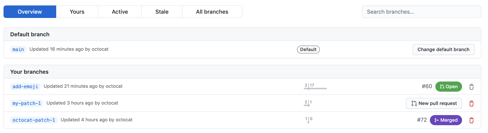

Viewing branches in your repository
===================================

Branches are central to collaboration on GitHub, and the best way to
view them is the branches page.

1.  On GitHub.com, navigate to the main page of the repository.

2.  Above the list of files, click **Branches**. 

3.  Use the navigation at the top of the page to view specific lists of
    branches:

    -   **Your branches**: In repositories that you have push access to,
        the **Yours** view shows all branches that you've pushed to,
        excluding the default branch, with the most recent branches
        first.
    -   **Active branches**: The **Active** view shows all branches that
        anyone has committed to within the last three months, ordered by
        the branches with the most recent commits first.
    -   **Stale branches**: The **Stale** view shows all branches that
        no one has committed to in the last three months, ordered by the
        branches with the oldest commits first.
    -   **All branches**: The **All** view shows the default branch,
        followed by all other branches ordered by the branches with the
        most recent commits first.

4.  Optionally, use the search field on the top right. It provides a
    simple, case-insensitive, sub-string search on the branch name. It
    does not support any additional query syntax.

#### Renaming a branch

You can change the name of a branch in a repository.

About renaming branches
-----------------------

When you rename a branch on GitHub.com, any URLs that contain the old
branch name are automatically redirected to the equivalent URL for the
renamed branch. Branch protection policies are also updated, as well as
the base branch for open pull requests (including those for forks) and
draft releases. After the rename is complete, GitHub provides
instructions on the repository\'s home page directing contributors to
update their local Git environments.

Although file URLs are automatically redirected, raw file URLs are not
redirected. Also, GitHub does not perform any redirects if users perform
a `git pull` for the previous branch name.

Renaming a branch
-----------------------------------------

1.  On GitHub.com, navigate to the main page of the repository.
2.  Above the list of files, click
    **Branches**. 
3.  In the list of branches, to the right of the branch you want to
    rename, click
    . 
4.  Type a new name for the branch. 
5.  Review the information about local environments, then click **Rename
    branch**. 

About changing the default branch
----------------------------------

You can choose the default branch for a repository. The default branch
is the base branch for pull requests and code commits.

Prerequisites
-------------------------------------------

To change the default branch, your repository must have more than one
branch.

Changing the default branch
-----------------------------------------------------------------------

1.  On GitHub.com, navigate to the main page of the repository.

2.  Under your repository name, click **Settings**. 

3.  In the \"Code and automation\" section of the sidebar, click
    **Branches**.

4.  Under \"Default branch\", to the right of the default branch name,
    click . 

5.  Use the drop-down, then click a branch name. 

6.  Click **Update**. 

7.  Read the warning, then click **I understand, update the default
    branch.** 

Deleting and restoring branches in a pull request
=================================================

If you have write access in a repository, you can delete branches that
are associated with closed or merged pull requests. You cannot delete
branches that are associated with open pull requests.

Deleting a branch used for a pull request
-------------------------------------------------------------------------------------------------------------------------

You can delete a branch that is associated with a pull request if the
pull request has been merged or closed and there are no other open pull
requests referencing the branch. For information on closing branches
that are not associated with pull requests, see \"[Creating and deleting
branches within your
repository].\"

1.  On GitHub.com, navigate to the main page of the repository.

2.  Under your repository name, click **Pull requests**.

    

3.  Click **Closed** to see a list of closed pull requests. 

4.  In the list of pull requests, click the pull request that\'s
    associated with the branch that you want to delete.

5.  Near the bottom of the pull request, click **Delete branch**.
    

    This button isn\'t displayed if there\'s currently an open pull
    request for this branch.

Restoring a deleted branch
-------------------------------------------------------------------------------------------

You can restore the head branch of a closed pull request.

1.  On GitHub.com, navigate to the main page of the repository.

2.  Under your repository name, click **Pull requests**.

    

3.  Click **Closed** to see a list of closed pull requests. 

4.  In the list of pull requests, click the pull request that\'s
    associated with the branch that you want to restore.

5.  Near the bottom of the pull request, click **Restore branch**.
    

